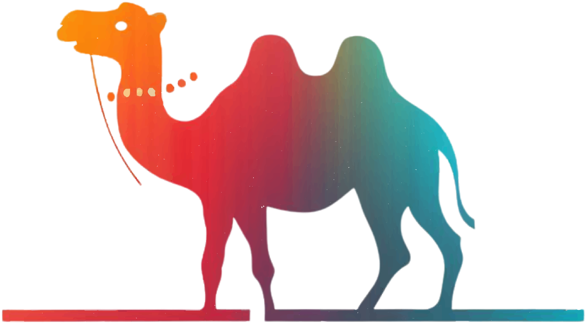

  

 

<!-- markdownlint-restore -->

 

 

# ⚡ كورس Starknet و ZK-Stark

مرحباً بك في كورس البناء على **Starknet** - محتوى الدورة التدريبية **إثباتات المعرفة الصفرية ZK-STARK وشبكة Starknet** في **[Web3Arabs](https://www.web3arabs.com)** - الأفضل لمطورين Web3 للتعرف على احد أهم حلول ZK-Rollups وتعلم لغة Cairo والبدء في بناء المشاريع على شبكة Starknet.

## 📚 الموارد الأساسية

يمكنك إستخدام الكورسات وورشات العمل الشاملة التي نقوم بنشرها، بالإضافة إلى الوثائق والكتب التي قام بإنشائها مجتمع Starknet،
والتي تغطي كل ما تحتاجه للبدء في تعلم إثبات ZK-Stark ولغة Cairo ومن ثم البناء على Starknet 🐺

- <a href="https://web3arabs.com/courses/3d88b1a4-ad68-400b-94d3-df89a5f95cfd/lessons">كورس إثبات المعرفة الصفرية ZK-STARK وشبكة Starknet</a>.
- <a href="https://youtube.com/playlist?list=PL7TQUwuCLstpWpNts5QYzJFyV44Qldz3J&si=inpaOue4cSD8f97c">قائمة تشغيل المعسكر التدريبي باللغة العربية على اليوتيوب</a>.
- <a href="https://docs.starknet.io/">وثائق وكتاب Starknet</a>.
- <a href="https://book.cairo-lang.org/">وثائق وكتاب لغة Cairo</a>.

## 🤝 المساهمة

نحن نبحث دائمًا عن مطورين متحمسين للانضمام إلى مجتمعنا والمساهمة في كورس **Starknet** باللغة العربية. [راجع دليل المساهمة الخاص بنا](CONTRIBUTING.md) للحصول على مزيد من المعلومات حول كيفية البدء.

## المساهمين ✨

كل الشكر إلى هؤلاء المساهمين الرائعين 📢:

<!-- ALL-CONTRIBUTORS-LIST:START - Do not remove or modify this section -->
<!-- prettier-ignore-start -->
<!-- markdownlint-disable -->
<table align="center">
  <tbody align="center">
    <tr align="center">
      <td align="center" valign="top" width="20%"><a href="https://github.com/KhairallahA"> <b>Khairallah @ Web3Arabs</b></a> <a href="https://github.com/Web3Arabs/starknet-course/commits?author=KhairallahA" title="Code">💻</a></td>
      <td align="center" valign="top" width="20%"><a href="https://github.com/NohaPepeep"> <b>Nuha Al-Sameai</b></a> <a href="https://github.com/Web3Arabs/starknet-course/commits?author=NohaPepeep" title="Code">💻</a></td>
      <td align="center" valign="top" width="20%"><a href="https://github.com/ArDapps"> <b>Bahaa @ ArDapps</b></a> <a href="https://github.com/Web3Arabs/starknet-course/commits?author=ArDapps" title="Code">💻</a></td>
      <td align="center" valign="top" width="20%"><a href="https://github.com/8kma"> <b>Khalil</b></a> <a href="https://github.com/Web3Arabs/starknet-course/commits?author=8kma" title="Code">💻</a></td>
      <td align="center" valign="top" width="20%"><a href="https://github.com/manx90"> <b>manx90</b></a> <a href="https://github.com/Web3Arabs/starknet-course/commits?author=manx90" title="Code">💻</a></td>
      <td align="center" valign="top" width="20%"><a href="https://github.com/malakbenh"> <b>manx90</b></a> <a href="https://github.com/Web3Arabs/starknet-course/commits?author=malakbenh" title="Code">💻</a></td>

    </tr>
  </tbody>
</table>

<!-- markdownlint-restore -->
<!-- prettier-ignore-end -->

<!-- ALL-CONTRIBUTORS-LIST:END -->

This project follows the
[all-contributors](https://github.com/all-contributors/all-contributors)
specification. Contributions of any kind welcome!
